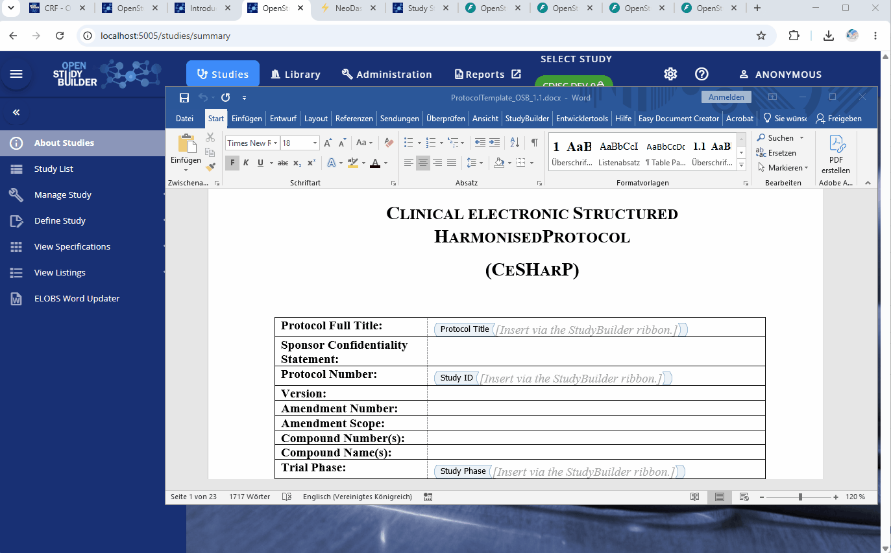

# elobs-word-updater

OpenStudyBuilder extension that auto-fills placeholders in Word files like the clinical study protocol with live study data

ELOBS is a new **E**xtension **L**ine for **O**penStudy**B**uilder **S**olution! This extension is available to automate the population of clinical study Word documents directly from [OpenStudyBuilder](https://openstudybuilder.com) data — no Microsoft Office required.

Clinical study teams maintain structured study data in OpenStudyBuilder (OSB). This tool bridges that data and Word-based study documents (protocols, synopses, etc.) by filling `SB_*` content controls in a `.docx` template with live study data fetched from the OSB API. It handles plain text fields, inclusion/exclusion criteria, merged sub-documents (flowchart, objectives & endpoints), and native SVG study design graphics.

**For end users:** generate a populated Word document from within OpenStudyBuilder in a few clicks via the integrated UI extension.

**For developers / integrators:** use the standalone CLI or import the Python library to build document generation into pipelines and scripts.



---

## Repository structure

This is a monorepo containing three independent but related parts:

```
elobs-word-updater/
├── core/                    # Standalone Python CLI and library (the master)
├── osb-api-extension/       # OpenStudyBuilder backend extension
└── osb-frontend-extension/  # OpenStudyBuilder frontend extension
```

### `core/` — Standalone CLI tool

A pip-installable Python package and command-line tool. Use this if you want to run document updates from the command line, a script, or a scheduled job — independently of OpenStudyBuilder.

→ [core/README.md](core/README.md)

### `osb-api-extension/` — OSB backend extension

A FastAPI extension that plugs into OpenStudyBuilder's extensions API. It exposes a single endpoint that accepts a Word template and study parameters, runs the core tool internally, and returns the populated document. Requires the `core` package to be installed in OSB's Python environment.

→ [osb-api-extension/README.md](osb-api-extension/README.md)

### `osb-frontend-extension/` — OSB frontend extension

A Vue.js extension for the OpenStudyBuilder UI. Adds a **ELOBS Word Updater** page under Studies where users can select a study, pick a version, choose which fields to populate, upload a template, and download the result — all from within OpenStudyBuilder.

→ [osb-frontend-extension/README.md](osb-frontend-extension/README.md)

---

## Which part do you need?

| Scenario | Use |
|---|---|
| Run from the command line or a script | `core/` only |
| Trigger document generation from within OpenStudyBuilder | `core/` + `osb-api-extension/` + `osb-frontend-extension/` |
| Build your own integration on top of the logic | `core/` as a pip dependency |

---

## How the parts relate

The `core/` package is the single source of truth for all document update logic. The OSB API extension is a thin wrapper — it imports and delegates to `core`, adding only an HTTP endpoint and a Pydantic request model. No logic is duplicated.

```
osb-frontend-extension   →   osb-api-extension   →   core
(Vue.js UI)                 (FastAPI endpoint)       (all logic)
```

---

## Supported content controls

Place content controls with `SB_*` tags in your Word template:

| Tag | Content |
|---|---|
| `SB_ProtocolTitle` | Protocol title |
| `SB_ProtocolTitleShort` | Short title |
| `SB_Acronym` | Study acronym |
| `SB_StudyID` | Study ID |
| `SB_StudyPhase` | Trial phase |
| `SB_EudraCTNumber` | EudraCT number |
| `SB_INDNumber` | IND number |
| `SB_UniversalTrialNumber` | UTN |
| `SB_InclusionCriteria` | Inclusion criteria (one paragraph per criterion) |
| `SB_ExclusionCriteria` | Exclusion criteria (one paragraph per criterion) |
| `SB_ObjectivesEndpoints` | Objectives & endpoints (full DOCX merged in) |
| `SB_Flowchart` / `SB_SoA` | Schedule of Activities (full DOCX merged in) |
| `SB_StudydesignGraphic` | Study design diagram (SVG, native Word SVG) |

---

## Local Docker setup (quick start)

To integrate both extensions into a locally running OpenStudyBuilder Docker Compose stack built from source:

**1. Copy the API and GUI extension into the OSB backend source:**

```
osb-api-extension/elobs_word_updater_ext/   →  clinical-mdr-api/extensions/elobs_word_updater_ext/
osb-frontend-extension/elobs-word-updater/  →  studybuilder/src/extensions/elobs-word-updater/
```

**2. Create (or update) `compose.override.yaml`** in your OSB Docker project to install the `core` package into the extensions API container:

```yaml
services:
  extensionsapi:
    volumes:
      - /path/to/elobs-word-updater/core:/tmp/elobs-core:ro
    command: >-
      sh -c "pipenv run pip install --quiet /tmp/elobs-core && exec pipenv run uvicorn"
```

> Replace `/path/to/elobs-word-updater` with the path where you cloned this repo.

> Once `elobs-word-updater` is published to PyPI, replace the volume mount and the `command` with a single `pip install elobs-word-updater` in the container — no `compose.override.yaml` will be needed at all.

**3. Restart the containers:**

```bash
docker compose up -d --build --force-recreate --no-deps extensionsapi
docker compose up -d --build --force-recreate --no-deps frontend
```

The fontent view is available at `http://localhost:5005/studies/elobs-word-updater`.

The backend SWAGGER Extension API is available at `http://localhost:5005/extensions-api/docs#/ElObsWordUpdater`.

---

## Requirements

- Python 3.11+
- A running OpenStudyBuilder instance (for live data; tests use a local dummy API)
- For the OSB extensions: OpenStudyBuilder with the extensions API enabled

---

## Acknowledgements

This project is derived from the [OpenStudyBuilder Word Add-In](https://github.com/NovoNordisk-OpenSource/openstudybuilder-word-addin) by Novo Nordisk A/S, which provided the concept and inspiration for populating Word documents from OpenStudyBuilder data. The original project is licensed under the MIT License — see [NOTICES](NOTICES) for the full upstream copyright notice.

This project was developed with [Claude](https://claude.ai) by Anthropic using Sonnet 4.6 and Opus 4.8.

---

## License

MIT License - Copyright (c) 2026 Katja Glass Consulting. See [LICENSE](LICENSE) for details.
